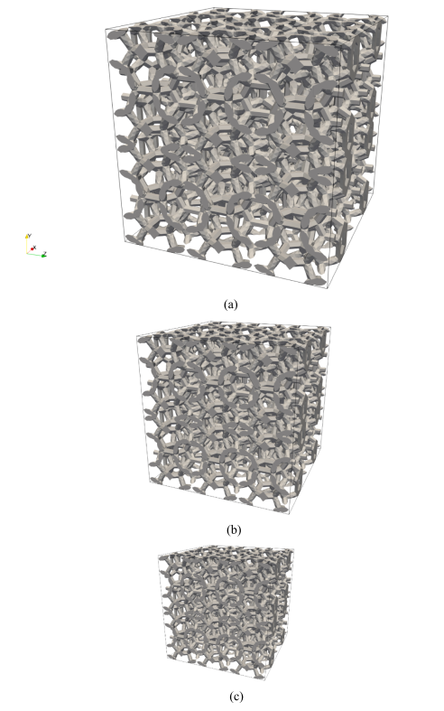
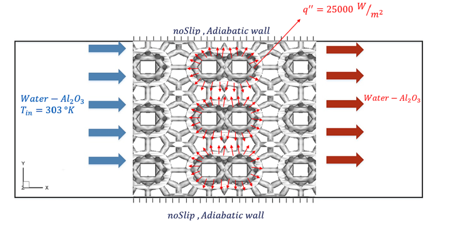
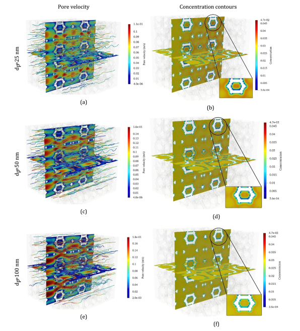

# simpleHeatFoam

OpenFOAM solver for pore-scale simulation of nanofluid flow and heat transfer in porous media.

---

## 📌 Overview

This repository provides a custom OpenFOAM solver (`simpleHeatFoam`) developed for direct numerical simulation (DNS) of nanofluid flow and heat transfer in open-cell metal foams (OCMFs).

The solver is based on the finite volume method (FVM) and implements a two-phase nanofluid model using Buongiorno’s formulation, accounting for key mechanisms such as Brownian diffusion.

The governing equations include:
- Continuity equation  
- Momentum equation  
- Nanoparticle transport equation  
- Energy equation  

The SIMPLE algorithm is used for pressure–velocity coupling.

This solver was developed based on the following research work:

📄 *Pore-scale analysis of two-phase nanofluid flow and heat transfer in open-cell metal foams considering Brownian motion*  
(Khoshtarash et al., 2023)

---

## 🔬 Physical Model

The solver simulates pore-scale transport processes in porous media using:

- Direct Numerical Simulation (DNS)
- Buongiorno’s nanofluid model
- Brownian motion effects
- Laminar incompressible flow

Key investigated parameters include:
- Nanoparticle diameter  
- Nanoparticle concentration  
- Brownian diffusion effects  
- Pore density of metal foams  

---

## 📁 Repository Structure

```
solver/
    simpleHeatFoam/
tutorials/
    tube/
related_papers/
figures/
README.md
CITATION.cff
.gitignore
LICENSE
```
## Governing model

The solver follows the pore-scale framework described in the paper and is based on a finite-volume implementation in OpenFOAM. The paper states that the continuity, momentum, nanoparticle distribution, and energy equations are solved using OpenFOAM, with SIMPLE for pressure–velocity coupling.

## Required fields and properties

### Fields
A typical case should provide at least these fields in the `0/` directory:
- `U`
- `p`
- `T`
- `alpha`

### `constant/transportProperties`
The solver reads the following properties:
- `rho_f`
- `mu_f`
- `c_f`
- `k_f`
- `rho_p`
- `c_p`
- `k_p`
- `dp`
- `alphaRef`
- `k_Boltzman`
- `lambda`
- `alphaEqActivation`
---

## ⚙️ Installation

Make sure OpenFOAM 7 is sourced:

```bash
source /path/to/OpenFOAM-7/etc/bashrc
```

Then compile the solver:

```bash
cd solver/simpleHeatFoam
wmake
```

---

## ▶️ Running the Tutorial

```bash
cd tutorials/tube
simpleHeatFoam
```

---

## 📊 Example Results

The solver reproduces pore-scale flow and heat transfer behavior in porous media, including:

- Velocity and pressure fields  
- Temperature distribution  
- Nanoparticle concentration  
- Nusselt number trends  

### Geometry of porous media


### Boundary conditions


### Temperature and flow distribution


---

## 📚 Citation

If you use this code, please cite:

Khoshtarash, H., Siavashi, M., Ramezanpour, M., & Blunt, M. J. (2023).  
*Pore-scale analysis of two-phase nanofluid flow and heat transfer in open-cell metal foams considering Brownian motion.*  
Applied Thermal Engineering, 221, 119847.  
https://doi.org/10.1016/j.applthermaleng.2022.119847

---

## 🧠 Notes

- Developed using OpenFOAM 7  
- Solver is based on SIMPLE algorithm  
- Designed for research and educational purposes  

---

## 📜 License

This project is licensed under the GPL-3.0 License.

---

## 👤 Author

Hamidreza Khoshtarash  
PhD Student – Civil & Environmental Engineering  
University of California, Davis
